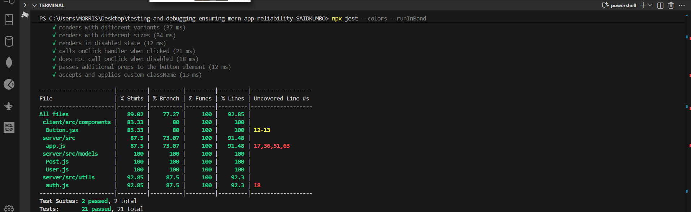
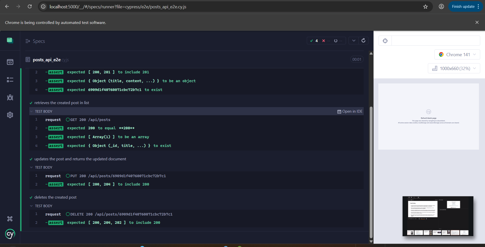
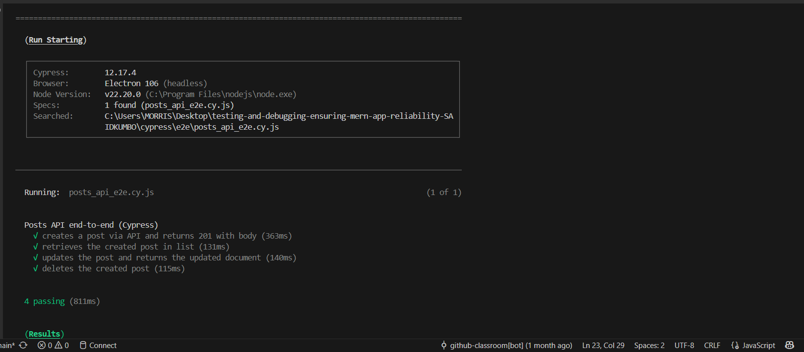
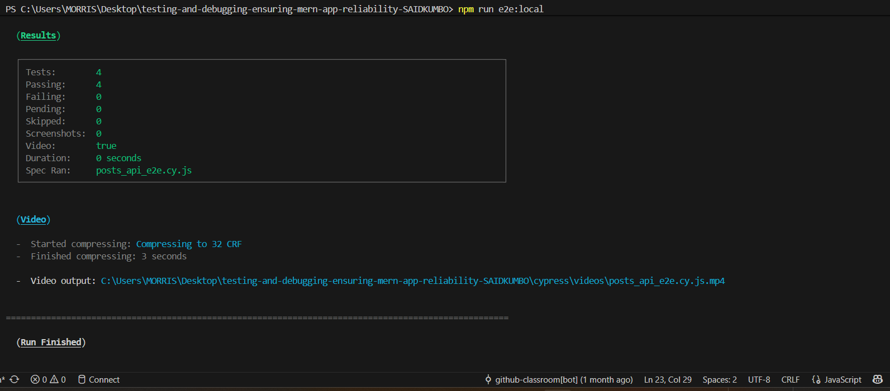
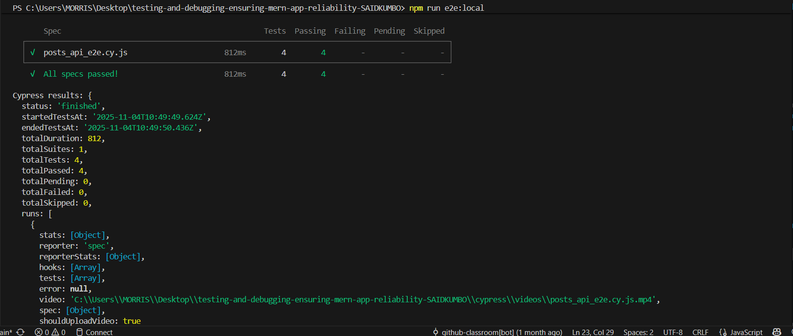
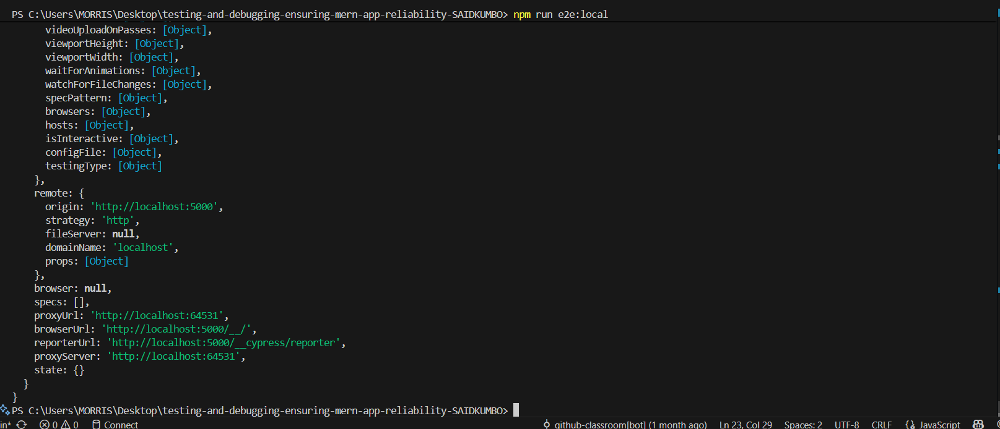

# Testing and Debugging — MERN App

This repository contains a small MERN-style project skeleton with tests and tooling added to help you run unit, integration, and end-to-end (E2E) tests locally. The assistant added minimal server components and E2E helpers so the provided tests run reliably; the project includes scripts to run tests and an optional orchestrator that starts a local server and runs Cypress E2E tests against a dedicated test database.

## Table of contents
- Project layout
- Prerequisites
- Install dependencies
- Run tests (unit & integration)
- Run E2E tests (Cypress)
- Postman collection
- Cleaning / artifacts
- Useful scripts
- Troubleshooting
- Next steps

---

## Project layout

Top-level folders you will use:

- `client/` — React client tests and source (unit tests live under `client/src/tests/`).
- `server/` — Express app and server-side tests (integration tests under `server/tests/`).
- `cypress/` — Cypress E2E specs, support files, and fixtures (added by assistant).
- `postman/` — Postman collection for API requests (optional import).
- `scripts/` — helper scripts (E2E orchestrator: `runE2EWithServer.js`).

Files of interest added during work:

- `scripts/runE2EWithServer.js` — starts a server (connects to a local MongoDB by default) then runs Cypress headless and shuts everything down.
- `server/scripts/startWithMemoryDb.js` — helper to start the server with an in-memory MongoDB (alternate mode).
- `postman/PostsAPI.postman_collection.json` — collection you can import into Postman to exercise the API.

---

## Prerequisites

- Node.js (recommended: 18+ or the version used in the workspace). The environment used in this repo runs Node.js v22 in the CI executed earlier, but Node 18+ is fine.
- npm (comes with Node)
- A local MongoDB instance if you plan to run E2E against `mongodb://localhost:27017/testing_e2e` (or change the `MONGO_URI` env var to point elsewhere). The orchestrator defaults to that DB name to keep test data isolated.

If you do not have MongoDB locally and prefer isolation, the repo contains an in-memory option (`server/scripts/startWithMemoryDb.js`) but the orchestrator currently defaults to the local DB.

---

## Install dependencies

Run from the repository root (PowerShell):

```powershell
npm install
# Also install server deps (optional if you only run root install):
cd server; npm install; cd ..
```

This installs root dev dependencies (Jest, Cypress, Babel) and server packages.

---

## Run tests (unit & integration)

Server tests (integration) — from `server/`:

```powershell
cd server
npm test
```

Client/unit tests — from `client/` (if you have client dependencies):

```powershell
cd client
npm test
```

Or run the root Jest runner (the workspace includes a multi-project Jest config):

```powershell
npx jest --colors --runInBand
```

Note: root `package.json` does not override `test` to run all projects automatically — the `npx jest` invocation above runs Jest directly with the repository config.

---

## Run E2E tests (Cypress)

There are two convenient ways to run the E2E tests. Both expect the API to be available at `http://localhost:5000` (the orchestrator will start it there):

1) Orchestrated (recommended — starts server + runs Cypress against a local `testing_e2e` DB):

```powershell
# from the repo root
npm run e2e:local
# or
node scripts/runE2EWithServer.js
```

What this does:
- Connects to MongoDB at `process.env.MONGO_URI` or `mongodb://localhost:27017/testing_e2e` by default.
- Starts the Express app (loads `server/src/app.js`).
- Creates a test user and writes a token to `cypress/fixtures/token.json` so protected requests can be authenticated.
- Runs the Cypress spec `cypress/e2e/posts_api_e2e.cy.js` headless.
- Cleans up the server and DB connection when done.

2) Manual (start server yourself, then run Cypress):

```powershell
# start your server the way you normally do (ensure it listens on :5000)
cd server; node scripts/startWithMemoryDb.js # starts on-memory DB and server (alternate)

# from repo root run cypress
npm run cypress:run
```

Interactive runner (to debug tests locally):

```powershell
npm run cypress:open
```

Important: The orchestrator writes `cypress/fixtures/token.json` — this file is excluded by `.gitignore` and is safe for local testing only.

---

## Postman collection

Import the Postman collection at `postman/PostsAPI.postman_collection.json`.

Create a Postman environment with variables:
- `baseUrl` = `http://localhost:5000`
- `token` = copy the value from `cypress/fixtures/token.json` (created by the orchestrator) or your auth flow.

The collection includes tests that set and assert `{{createdId}}` so the requests can run in sequence.

---

## Cleaning / artifacts

You can remove generated artifacts with the following commands (PowerShell):

```powershell
# remove coverage and Cypress artifacts
Remove-Item -Recurse -Force .\coverage -ErrorAction SilentlyContinue
Remove-Item -Recurse -Force .\cypress\videos -ErrorAction SilentlyContinue
Remove-Item -Recurse -Force .\cypress\screenshots -ErrorAction SilentlyContinue
Remove-Item -Force .\cypress\fixtures\token.json -ErrorAction SilentlyContinue
```

The repository includes a `.gitignore` configured to ignore these artifacts.

---

## Useful scripts (root)

- `npm run e2e:local` — start the local orchestrator and run Cypress E2E against `testing_e2e` DB.
- `npm run cypress:open` — open Cypress interactive runner.
- `npm run cypress:run` — run Cypress headless (expects server running at `http://localhost:5000`).

Server scripts (in `server/package.json`):
- `npm test` — run Jest for server tests.
- `npm run start:mem` — start the server using `server/scripts/startWithMemoryDb.js` (in-memory DB) — useful for quick local runs.

---

## Troubleshooting

- Cannot GET / — expected if the Express app has no root route. Use `GET /api/posts` to check the API.
- E2E / token errors — ensure MongoDB is running at `mongodb://localhost:27017/testing_e2e` or set `MONGO_URI` before running orchestrator.

Example to run with alternate DB:

```powershell
# run with custom DB
$env:MONGO_URI='mongodb://localhost:27017/my_test_db'; node scripts/runE2EWithServer.js
```

---

## Next steps & notes

- Add UI-driven Cypress tests (visiting the React client) — requires the client to be served and may need selectors updated.
- Add unit tests for more components and server units to reach the >=70% coverage target for the assignment.
- Consider adding a small `clean` npm script to remove artifacts cross-platform.

If you want, I can also open a PR with these changes, remove assistant helper files, or revert parts of the work — tell me how strict you want the repo relative to the original starter.

---

If you want this README shortened, expanded with diagrams, or converted into a step-by-step submission guide (with screenshots and artifacts), tell me which format you prefer and I will update it.

---

## Screenshots

Below are the screenshots captured during testing and debugging. Open them from the `docs/screenshots/` folder or view them in your editor.














